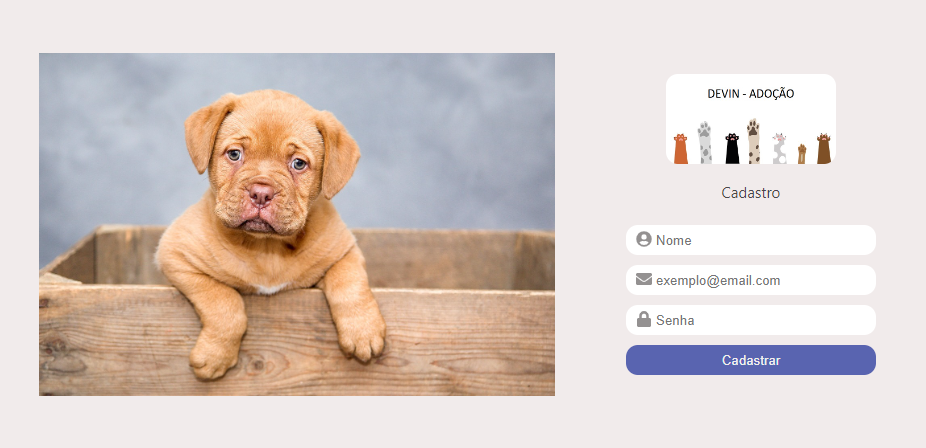

# DEVin-Adotion

Este projeto é um sistema de controle de estoque para ONGs. Com ele é possível identificar a quantidade de estoque de produtos para tratamento e alimentação de cães e gatos, de acordo com sua categoria de adulto ou filhote.

## Funcionalidades do projeto

✔️ Cadastro de Usuário
* Nome
* E-mail
* Senha

✔️ Login de Usuário
* E-mail
* Senha

✔️ Estoque
* Nome do Estoque
* Tipo de Produtos
    * gato
    * cachorro

✔️ Produtos
* Nome do Produto
* Quantidade
* Tipo de Produto
    * gato
    * cachorro
* Categoria de animal
    * Filhote
    * Adulto

## Layout
### Tela de Cadastro


### Tela de Login


## Como rodar este projeto ?
```bash
# Clone este repositório
$ Git clone link-do-repositório

# Acesse a pasta do projeto no seu terminal
$ cd adotation

# Instale as dependências
$ npm install

# Execute a aplicação
$ npm start

# A aplicação será iniciada na porta 3000, acesse pelo navegador http://localhost:3000
```

## Tecnologias utilizadas
✔️ React

✔️ React Router

✔️ React Icons

✔️ CSS

✔️ HTML


#

## 👏Pessoas envolvidas no projeto

<a href= "https://www.linkedin.com/in/maristelapeglow/" target= "_blank"> Maristela
#
<a href= "https://www.linkedin.com/in/renato-aires-5128b7189/" target= "_blank"> Renato
#
<a href= "https://www.linkedin.com/in/vini-andrade-35ab6421/" target= "_blank"> Vinícius