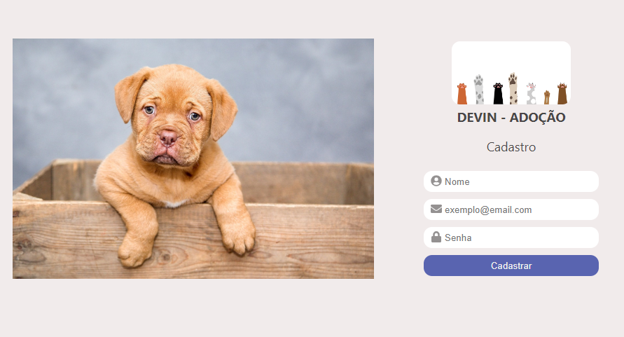
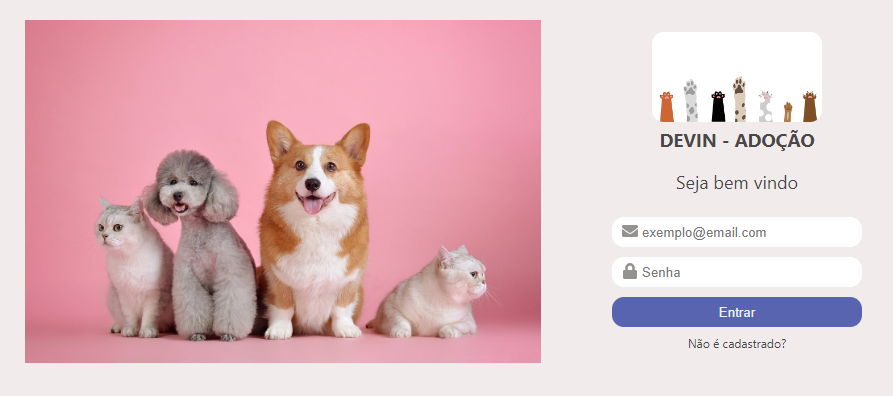
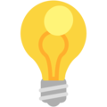

# DEVin-Adotion

Este projeto é um sistema de controle de estoque para ONGs. Com ele é possível identificar a quantidade de estoque de produtos para tratamento e alimentação de cães e gatos, de acordo com sua categoria de adulto ou filhote.

## Funcionalidades do projeto

-[x] Cadastro de Usuário
* Nome
* E-mail
* Senha

-[x] Login de Usuário
* E-mail
* Senha

-[x] Estoque
* Nome do Estoque
* ?
* ?

-[x] Produtos
* Nome do Produto
* Quantidade
* Tipo de Produto
    * gato
    * cachorro
* Categoria de animal
    * Filhote
    * Adulto

## Layout
### Tela de Cadastro


### Tela de Login


 aqui printar demais telas depois de prontas

## Como rodar este projeto ?
```bash
# Clone este repositório
$ Git clone link-do-repositório

# Acesse a pasta do projeto no seu terminal
$ cd adotation

# Instale as dependências
$ npm install

# Execute a aplicação
$ npm start

# A aplicação será iniciada na porta 3000, acesse pelo navegador http://localhost:3000
```

## Tecnologias utilizadas
-[x] React

-[x] React Router

-[x] React Icons

-[x] CSS

-[x] HTML

não sei se faltou alguma ou se devemos ignorar html e css 

#

## 👏Pessoas envolvidas no projeto

<a href= "https://www.linkedin.com/in/maristelapeglow/" target= "_blank"> Maristela
#
<a href= "https://www.linkedin.com/in/renato-aires-5128b7189/" target= "_blank"> Renato
#
<a href= "https://www.linkedin.com/in/" target= "_blank"> Vinicius